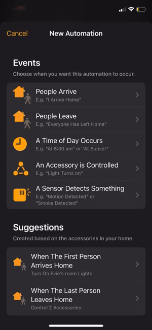

# Control Your Escea Gas Fire

## Compatibility.

I have so far only been able to test this with the DF700. However, the project on which it is base has tested the DX1500 DX1000
DS1400 DF700) so it should work with those. Please let me know if you find it to be working on your model. Use at your own risk.

## Configuration. 
You should enter the IP address of your fire and the name to give the fire. Platform should not need to be changed

## Temperature sensor

This accessory contains both the fire and a separate temperature sensor. This allows you to create automations in HomeKit based upon
temperature and time.

```
{
    "name": "Fire",
    "ip": "192.168.1.27",
    "platform": "EsceaGasFireHomebridgePlugin"
}
```

 
#

#


# Developing

Please clone and create a branch with your feature/fix name as the branch name

## API
This project builds upon the work by [@snikchnz](https://github.com/snikch) and his python project. That [project](https://github.com/snikch/escea#readme) contains a link to the [Escea Fireplace LAN Communications Protocol Specification Document](images/630260_3.Escea.Fireplace.LAN.Comms.Spec.pdf) which is reproduced here.

## Install Development Dependencies

Using a terminal, navigate to the project folder and run this command to install the development dependencies:

```
npm install
```

## Build Plugin

TypeScript needs to be compiled into JavaScript before it can run. The following command will compile the contents of your [`src`](./src) directory and put the resulting code into the `dist` folder.

```
npm run build
```

## Link To Homebridge

Run this command so your global install of Homebridge can discover the plugin in your development environment:

```
npm link
```

You can now start Homebridge, use the `-D` flag so you can see debug log messages in your plugin:

```
homebridge -D
```

## Watch For Changes and Build Automatically

If you want to have your code compile automatically as you make changes, and restart Homebridge automatically between changes you can run:

```
npm run watch
```

This will launch an instance of Homebridge in debug mode which will restart every time you make a change to the source code. It will load the config stored in the default location under `~/.homebridge`. You may need to stop other running instances of Homebridge while using this command to prevent conflicts. You can adjust the Homebridge startup command in the [`nodemon.json`](./nodemon.json) file.

